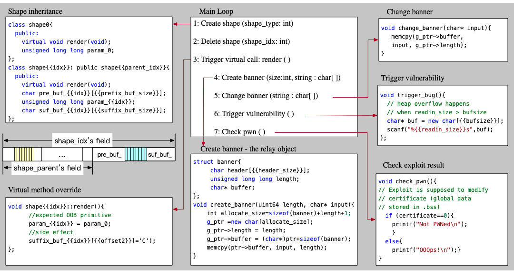
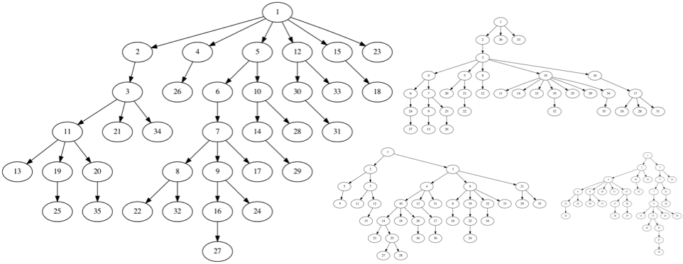
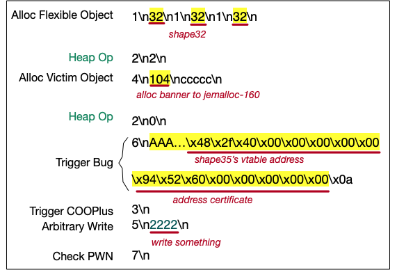

# VScape_motivation_case

This motivation case is a CTF-like challenge, but can help understand why we need VScape to facilitate exploit construction for COOPLUS. This repo is an extension for paper content, from which you can find the challenge source in `genChallenge`.

### The Usage

The challenge code is generated with random configurations with command shown as below:

```shell
python3 generate_challenge.py
```

Then you will get `challenge.cpp` in your project directory. Compile the `challenge.cpp` like this:

```shell
clang++ challenge.cpp \
-Xclang -fdump-verbose -Xclang -fdump-eachlayout \
-fsanitize=cfi -fvisibility=hidden -flto  \
-o challenge \
-L`jemalloc-config --libdir` -Wl,-rpath,`jemalloc-config --libdir` -ljemalloc `jemalloc-config --libs`
# compile the challenge with jemalloc and llvm-cfi enabled
# meanwhile we will collect struct information with -fdump-* plugins
```


### The Intuision

Here is the summary of the victim program.



This program implements polymorphism with a series of shape classes. The step 3 in the main loop triggers virtual call ::render() for each created shape. For simplicity, we do not show the global inheritance in this figure, but present a template for shape declaration. The derived shape implements three exclusive fields - `pref_buf_{{idx}}, param\_{{idx}} and sub_buf_{{idx}}`; The overridden ::render() wirtes param_0 into para_{{idx}}, making it an ideal candidate primitive for COOPLUS.

Furthermore, the banner is a flexible structure, which is similar to objects used in kernel exploitation. It has a length field that controls the size for a content buffer, and maintains a pointer to it. For simplicity, create_banner() places the buffer close to the banner object. Then at step 5 of the main loop, analysts are able to modify data in this buffer.

The overflow vulnerability locates at trigger_bug(). The {{bufsize}} determines the chunk size in the cache, whereas the {{readin_size}} defines the maximum length for read-in bytes. Assuming the goal of exploit is to corrupt the certificate in the global segment at runtime, we can verify the consequence for our attack with the use of check_pwn() at step 7. Lastly, we build the motivation example with the jemalloc heap allocator and the LLVM-CFI defense.

Moreover, to reflect the complexity of class hierarchy in real world application, this sample program implements **more than thirty** shape_{{idx}} classes with randomly generated `pre-` and `suf-` fields. It is hard for analysts to find a correct solution without systematic approaches, to corrupt the certificate field when a semantics-aware CFI (i.e., LLVM-CFI) is deployed.


As you can see from figure below, the inheritance of _shape_ is intricate, and it is not efficient to solve with manual analysis.




### Solution

Manual efforts are required to write an exploit template like the  `autogen.py`.  The arguments taken by function _genexp()_ are exactly what VScape outputs in a multi-step analysis.

```
    genexp(
        victim_type_num=3,
        counterfeit_type_num=11,
        chunk_range=160,
        oob_offset = 0,
        overwrittern_data_size = 178,
        critical_data_offset = 0, # vptr 
        )
```

In this way, VScape provides qualified primitives for the exploit template to compose the final exploit. Figure below shows an example exploit, where texts in yellow background are generated by VScape.



